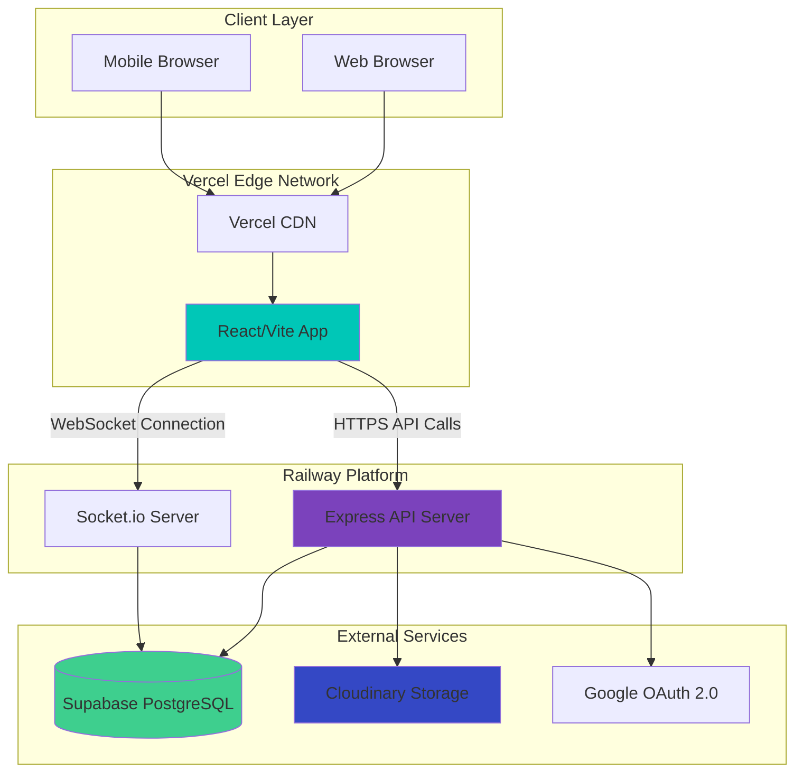
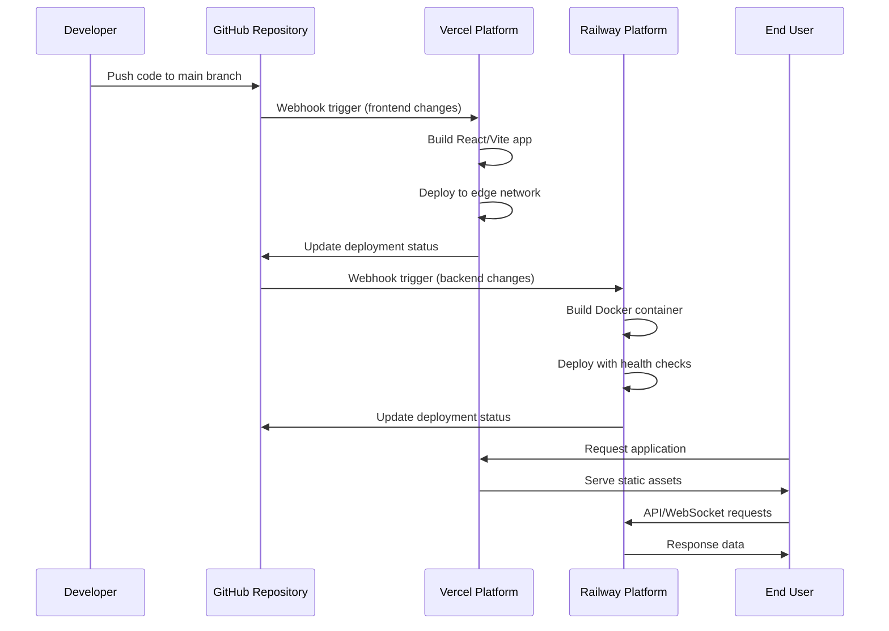

# Design Document: MERN Stack Deployment & Hosting

## Overview

This design document outlines the production deployment architecture for a MERN (MongoDB/Supabase, Express, React, Node.js) stack application. The application features real-time chat functionality via Socket.io, file uploads through Cloudinary, Google OAuth authentication, and multiple frontend modules including chat, community features, and an ATS system. The deployment strategy leverages modern Platform-as-a-Service (PaaS) providers to minimize operational overhead while maintaining production-grade reliability and security.

The architecture separates frontend and backend deployments across specialized platforms: Vercel for the React/Vite frontend (providing edge CDN, automatic HTTPS, and zero-config deployments) and Railway for the Node.js/Express backend (offering simple container orchestration, environment management, and persistent connections for WebSocket support). The existing Supabase PostgreSQL database remains unchanged, eliminating migration complexity. This design prioritizes developer experience, cost efficiency, and scalability while addressing critical production concerns including secrets management, CORS configuration, real-time connection handling, and CI/CD automation.

## Architecture

### High-Level System Architecture



### Deployment Flow Architecture



## Components and Interfaces

### Component 1: Frontend Deployment (Vercel)

**Purpose**: Serve the React/Vite application as static assets through a global CDN with automatic HTTPS, edge caching, and instant rollbacks.

**Interface**:
```typescript
interface VercelDeployment {
  buildCommand: string
  outputDirectory: string
  environmentVariables: EnvironmentConfig
  rewrites: RewriteRule[]
  headers: SecurityHeader[]
}

interface EnvironmentConfig {
  VITE_API_URL: string
  VITE_SOCKET_URL: string
  VITE_GOOGLE_CLIENT_ID: string
  VITE_CLOUDINARY_CLOUD_NAME: string
}
```

**Responsibilities**:
- Build and optimize React application for production
- Serve static assets via global CDN
- Handle client-side routing with SPA rewrites
- Inject environment variables at build time
- Provide automatic HTTPS certificates
- Enable preview deployments for pull requests

### Component 2: Backend Deployment (Railway)

**Purpose**: Host the Node.js/Express API server with persistent WebSocket connections, environment variable management, and container orchestration.

**Interface**:
```typescript
interface RailwayDeployment {
  startCommand: string
  buildCommand: string
  environmentVariables: BackendEnvironmentConfig
  healthCheckPath: string
  port: number
}

interface BackendEnvironmentConfig {
  NODE_ENV: string
  PORT: number
  DATABASE_URL: string
  SUPABASE_URL: string
  SUPABASE_ANON_KEY: string
  SUPABASE_SERVICE_ROLE_KEY: string
  CLOUDINARY_CLOUD_NAME: string
  CLOUDINARY_API_KEY: string
  CLOUDINARY_API_SECRET: string
  GOOGLE_CLIENT_ID: string
  GOOGLE_CLIENT_SECRET: string
  JWT_SECRET: string
  FRONTEND_URL: string
  SESSION_SECRET: string
}
```

**Responsibilities**:
- Run Express server with production optimizations
- Maintain WebSocket connections for Socket.io
- Handle database connections with connection pooling
- Manage secure environment variables
- Provide application logs and metrics
- Auto-restart on crashes with health checks

### Component 3: Database Layer (Supabase)

**Purpose**: Provide managed PostgreSQL database with connection pooling, automatic backups, and built-in authentication features.

**Interface**:
```typescript
interface SupabaseConnection {
  connectionString: string
  poolSize: number
  connectionTimeout: number
  idleTimeout: number
}

interface SupabaseClient {
  url: string
  anonKey: string
  serviceRoleKey: string
}
```

**Responsibilities**:
- Store application data with ACID guarantees
- Provide connection pooling for scalability
- Handle automatic backups and point-in-time recovery
- Expose REST and GraphQL APIs (if used)

### Component 4: File Storage (Cloudinary)

**Purpose**: Handle image and file uploads with automatic optimization, transformation, and CDN delivery.

**Interface**:
```typescript
interface CloudinaryConfig {
  cloudName: string
  apiKey: string
  apiSecret: string
  uploadPreset?: string
  folder?: string
}

interface CloudinaryUpload {
  upload(file: Buffer, options: UploadOptions): Promise<UploadResult>
  destroy(publicId: string): Promise<DestroyResult>
}
```

**Responsibilities**:
- Accept file uploads from backend API
- Optimize images automatically
- Serve files via CDN
- Provide transformation URLs

### Component 5: Authentication (Google OAuth)

**Purpose**: Provide secure user authentication via Google OAuth 2.0 flow with JWT token management.

**Interface**:
```typescript
interface GoogleOAuthConfig {
  clientId: string
  clientSecret: string
  redirectUri: string
  scope: string[]
}

interface AuthenticationFlow {
  initiateOAuth(): string
  handleCallback(code: string): Promise<UserProfile>
  generateJWT(user: UserProfile): string
  verifyJWT(token: string): Promise<UserProfile>
}
```

**Responsibilities**:
- Handle OAuth 2.0 authorization flow
- Exchange authorization codes for access tokens
- Retrieve user profile information
- Generate and verify JWT tokens
- Manage session state

### Component 6: Real-Time Communication (Socket.io)

**Purpose**: Enable bidirectional real-time communication for chat features with connection management and room-based messaging.

**Interface**:
```typescript
interface SocketIOConfig {
  cors: CORSConfig
  transports: string[]
  pingTimeout: number
  pingInterval: number
}

interface SocketIOServer {
  on(event: string, handler: Function): void
  emit(event: string, data: any): void
  to(room: string): SocketIONamespace
}
```

**Responsibilities**:
- Maintain persistent WebSocket connections
- Handle connection/disconnection events
- Manage chat rooms and namespaces
- Broadcast messages to connected clients
- Handle reconnection logic

## Data Models

### Model 1: Deployment Configuration

```typescript
interface DeploymentConfig {
  environment: 'development' | 'staging' | 'production'
  frontend: FrontendConfig
  backend: BackendConfig
  database: DatabaseConfig
  services: ExternalServicesConfig
}

interface FrontendConfig {
  platform: 'vercel'
  domain?: string
  buildCommand: string
  outputDirectory: string
  nodeVersion: string
  environmentVariables: Record<string, string>
}

interface BackendConfig {
  platform: 'railway'
  domain?: string
  startCommand: string
  buildCommand?: string
  nodeVersion: string
  port: number
  healthCheckPath: string
  environmentVariables: Record<string, string>
}

interface DatabaseConfig {
  provider: 'supabase'
  connectionString: string
  poolSize: number
  ssl: boolean
}

interface ExternalServicesConfig {
  cloudinary: CloudinaryConfig
  googleOAuth: GoogleOAuthConfig
}
```

**Validation Rules**:
- All environment variables must be non-empty strings
- Port must be between 1024 and 65535
- Connection pool size must be positive integer
- URLs must be valid HTTPS endpoints
- Node version must match between frontend and backend

### Model 2: Environment Variables Schema

```typescript
interface EnvironmentVariables {
  // Frontend (Vite) - Build-time variables
  VITE_API_URL: string              // Railway backend URL
  VITE_SOCKET_URL: string           // Railway WebSocket URL
  VITE_GOOGLE_CLIENT_ID: string     // Google OAuth client ID
  VITE_CLOUDINARY_CLOUD_NAME: string // Cloudinary cloud name
  
  // Backend (Express) - Runtime variables
  NODE_ENV: 'production' | 'development'
  PORT: number
  DATABASE_URL: string              // Supabase connection string
  SUPABASE_URL: string
  SUPABASE_ANON_KEY: string
  SUPABASE_SERVICE_ROLE_KEY: string
  CLOUDINARY_CLOUD_NAME: string
  CLOUDINARY_API_KEY: string
  CLOUDINARY_API_SECRET: string
  GOOGLE_CLIENT_ID: string
  GOOGLE_CLIENT_SECRET: string
  JWT_SECRET: string                // For token signing
  SESSION_SECRET: string            // For session management
  FRONTEND_URL: string              // Vercel frontend URL for CORS
}
```

**Validation Rules**:
- All secrets (JWT_SECRET, SESSION_SECRET, API keys) must be cryptographically random strings (minimum 32 characters)
- URLs must include protocol (https://)
- PORT must match Railway's exposed port
- NODE_ENV must be 'production' in production deployments
- FRONTEND_URL and VITE_API_URL must match actual deployment URLs

## Algorithmic Pseudocode

### Main Deployment Algorithm

```pascal
ALGORITHM deployMERNApplication(config)
INPUT: config of type DeploymentConfig
OUTPUT: deploymentResult of type DeploymentResult

BEGIN
  ASSERT config.environment IN ['development', 'staging', 'production']
  ASSERT validateEnvironmentVariables(config) = true
  
  // Step 1: Prepare deployment artifacts
  artifacts ← prepareDeploymentArtifacts(config)
  
  // Step 2: Deploy backend first (Railway)
  backendDeployment ← deployBackend(config.backend, artifacts.backend)
  ASSERT backendDeployment.status = 'healthy'
  
  // Step 3: Update frontend config with backend URL
  config.frontend.environmentVariables['VITE_API_URL'] ← backendDeployment.url
  config.frontend.environmentVariables['VITE_SOCKET_URL'] ← backendDeployment.url
  
  // Step 4: Deploy frontend (Vercel)
  frontendDeployment ← deployFrontend(config.frontend, artifacts.frontend)
  ASSERT frontendDeployment.status = 'ready'
  
  // Step 5: Update backend CORS with frontend URL
  updateBackendEnvironment('FRONTEND_URL', frontendDeployment.url)
  
  // Step 6: Verify end-to-end connectivity
  healthCheck ← verifyDeployment(frontendDeployment.url, backendDeployment.url)
  ASSERT healthCheck.frontend = true AND healthCheck.backend = true
  
  // Step 7: Run smoke tests
  smokeTests ← runSmokeTests(frontendDeployment.url)
  ASSERT smokeTests.passed = true
  
  RETURN {
    status: 'success',
    frontend: frontendDeployment,
    backend: backendDeployment,
    timestamp: now()
  }
END
```

**Preconditions:**
- config is validated and well-formed
- All required environment variables are set
- GitHub repository is accessible
- Platform credentials (Vercel, Railway) are valid
- External services (Supabase, Cloudinary, Google OAuth) are operational

**Postconditions:**
- Backend is deployed and healthy
- Frontend is deployed and accessible
- CORS is properly configured
- All health checks pass
- Deployment URLs are recorded

**Loop Invariants:** N/A (no loops in main algorithm)

### Backend Deployment Algorithm

```pascal
ALGORITHM deployBackend(backendConfig, artifacts)
INPUT: backendConfig of type BackendConfig, artifacts of type BuildArtifacts
OUTPUT: deployment of type RailwayDeployment

BEGIN
  // Step 1: Connect to Railway platform
  railway ← connectToRailway(credentials)
  
  // Step 2: Create or update service
  service ← railway.getOrCreateService('backend')
  
  // Step 3: Set environment variables
  FOR each variable IN backendConfig.environmentVariables DO
    ASSERT variable.key IS NOT empty
    ASSERT variable.value IS NOT empty
    service.setEnvironmentVariable(variable.key, variable.value)
  END FOR
  
  // Step 4: Configure service settings
  service.setStartCommand(backendConfig.startCommand)
  service.setHealthCheck(backendConfig.healthCheckPath)
  service.setPort(backendConfig.port)
  
  // Step 5: Trigger deployment from GitHub
  deployment ← service.deployFromGitHub(artifacts.commitHash)
  
  // Step 6: Wait for deployment with timeout
  timeout ← 300 // 5 minutes
  elapsed ← 0
  WHILE deployment.status NOT IN ['ready', 'failed'] AND elapsed < timeout DO
    WAIT 5 seconds
    elapsed ← elapsed + 5
    deployment ← service.getDeploymentStatus(deployment.id)
  END WHILE
  
  ASSERT deployment.status = 'ready'
  
  // Step 7: Verify health check
  healthResponse ← httpGet(deployment.url + backendConfig.healthCheckPath)
  ASSERT healthResponse.status = 200
  
  RETURN {
    id: deployment.id,
    url: deployment.url,
    status: 'healthy',
    timestamp: now()
  }
END
```

**Preconditions:**
- Railway credentials are valid
- backendConfig contains all required fields
- GitHub repository is connected to Railway
- Environment variables are validated
- Health check endpoint exists in application

**Postconditions:**
- Service is deployed and running
- All environment variables are set
- Health check returns 200 OK
- Deployment URL is accessible
- Service is ready to accept requests

**Loop Invariants:**
- elapsed time is always less than or equal to timeout
- deployment status is checked every 5 seconds
- deployment object remains valid throughout loop

### Frontend Deployment Algorithm

```pascal
ALGORITHM deployFrontend(frontendConfig, artifacts)
INPUT: frontendConfig of type FrontendConfig, artifacts of type BuildArtifacts
OUTPUT: deployment of type VercelDeployment

BEGIN
  // Step 1: Connect to Vercel platform
  vercel ← connectToVercel(credentials)
  
  // Step 2: Create or update project
  project ← vercel.getOrCreateProject('frontend')
  
  // Step 3: Set environment variables
  FOR each variable IN frontendConfig.environmentVariables DO
    ASSERT variable.key STARTS WITH 'VITE_'
    ASSERT variable.value IS NOT empty
    project.setEnvironmentVariable(variable.key, variable.value, 'production')
  END FOR
  
  // Step 4: Configure build settings
  project.setBuildCommand(frontendConfig.buildCommand)
  project.setOutputDirectory(frontendConfig.outputDirectory)
  project.setNodeVersion(frontendConfig.nodeVersion)
  
  // Step 5: Configure SPA routing
  project.addRewrite({
    source: '/(.*)',
    destination: '/index.html'
  })
  
  // Step 6: Trigger deployment from GitHub
  deployment ← project.deployFromGitHub(artifacts.commitHash)
  
  // Step 7: Wait for deployment with timeout
  timeout ← 300 // 5 minutes
  elapsed ← 0
  WHILE deployment.status NOT IN ['ready', 'error'] AND elapsed < timeout DO
    WAIT 5 seconds
    elapsed ← elapsed + 5
    deployment ← project.getDeploymentStatus(deployment.id)
  END WHILE
  
  ASSERT deployment.status = 'ready'
  
  // Step 8: Verify deployment accessibility
  response ← httpGet(deployment.url)
  ASSERT response.status = 200
  ASSERT response.headers['content-type'] CONTAINS 'text/html'
  
  RETURN {
    id: deployment.id,
    url: deployment.url,
    status: 'ready',
    timestamp: now()
  }
END
```

**Preconditions:**
- Vercel credentials are valid
- frontendConfig contains all required fields
- GitHub repository is connected to Vercel
- All VITE_ environment variables are set
- Build command produces valid output

**Postconditions:**
- Project is deployed to Vercel edge network
- All environment variables are injected at build time
- SPA routing is configured
- Deployment URL returns 200 OK
- Static assets are served via CDN

**Loop Invariants:**
- elapsed time is always less than or equal to timeout
- deployment status is checked every 5 seconds
- deployment object remains valid throughout loop

### Environment Variable Validation Algorithm

```pascal
ALGORITHM validateEnvironmentVariables(config)
INPUT: config of type DeploymentConfig
OUTPUT: isValid of type boolean

BEGIN
  requiredFrontendVars ← [
    'VITE_API_URL',
    'VITE_SOCKET_URL',
    'VITE_GOOGLE_CLIENT_ID',
    'VITE_CLOUDINARY_CLOUD_NAME'
  ]
  
  requiredBackendVars ← [
    'NODE_ENV',
    'PORT',
    'DATABASE_URL',
    'SUPABASE_URL',
    'SUPABASE_ANON_KEY',
    'SUPABASE_SERVICE_ROLE_KEY',
    'CLOUDINARY_CLOUD_NAME',
    'CLOUDINARY_API_KEY',
    'CLOUDINARY_API_SECRET',
    'GOOGLE_CLIENT_ID',
    'GOOGLE_CLIENT_SECRET',
    'JWT_SECRET',
    'SESSION_SECRET',
    'FRONTEND_URL'
  ]
  
  // Validate frontend variables
  FOR each varName IN requiredFrontendVars DO
    IF varName NOT IN config.frontend.environmentVariables THEN
      RETURN false
    END IF
    
    value ← config.frontend.environmentVariables[varName]
    IF value IS empty OR value IS null THEN
      RETURN false
    END IF
  END FOR
  
  // Validate backend variables
  FOR each varName IN requiredBackendVars DO
    IF varName NOT IN config.backend.environmentVariables THEN
      RETURN false
    END IF
    
    value ← config.backend.environmentVariables[varName]
    IF value IS empty OR value IS null THEN
      RETURN false
    END IF
    
    // Validate secrets have minimum length
    IF varName IN ['JWT_SECRET', 'SESSION_SECRET'] THEN
      IF length(value) < 32 THEN
        RETURN false
      END IF
    END IF
    
    // Validate URLs have proper format
    IF varName ENDS WITH '_URL' THEN
      IF NOT value STARTS WITH 'https://' THEN
        RETURN false
      END IF
    END IF
  END FOR
  
  // Validate PORT is valid number
  port ← config.backend.environmentVariables['PORT']
  IF NOT isInteger(port) OR port < 1024 OR port > 65535 THEN
    RETURN false
  END IF
  
  // All validations passed
  RETURN true
END
```

**Preconditions:**
- config parameter is provided and not null
- config.frontend and config.backend exist
- environmentVariables objects exist

**Postconditions:**
- Returns true if and only if all required variables are present and valid
- Returns false if any validation check fails
- No side effects on config parameter

**Loop Invariants:**
- All previously checked variables were valid when loop continues
- Validation state remains consistent throughout iteration

## Key Functions with Formal Specifications

### Function 1: configureCORS()

```typescript
function configureCORS(frontendURL: string): CORSOptions
```

**Preconditions:**
- frontendURL is non-empty string
- frontendURL is valid HTTPS URL
- frontendURL matches deployed Vercel domain

**Postconditions:**
- Returns valid CORSOptions object
- origin includes frontendURL
- credentials is set to true
- methods includes all required HTTP methods
- No side effects on input parameter

**Loop Invariants:** N/A (no loops)

### Function 2: configureSocketIO()

```typescript
function configureSocketIO(server: HTTPServer, corsOrigin: string): SocketIOServer
```

**Preconditions:**
- server is valid HTTP server instance
- server is listening on configured port
- corsOrigin is non-empty string
- corsOrigin is valid HTTPS URL

**Postconditions:**
- Returns configured Socket.IO server instance
- CORS is configured with corsOrigin
- transports include ['websocket', 'polling']
- pingTimeout and pingInterval are set
- Server is ready to accept connections

**Loop Invariants:** N/A (no loops)

### Function 3: initializeDatabaseConnection()

```typescript
function initializeDatabaseConnection(config: DatabaseConfig): DatabasePool
```

**Preconditions:**
- config is non-null and well-formed
- config.connectionString is valid PostgreSQL connection string
- config.poolSize is positive integer
- Database server is accessible

**Postconditions:**
- Returns active database connection pool
- Pool size matches config.poolSize
- SSL is enabled if config.ssl is true
- Connection is verified with test query
- Pool is ready to execute queries

**Loop Invariants:** N/A (no loops)

### Function 4: buildProductionAssets()

```typescript
function buildProductionAssets(buildCommand: string, outputDir: string): BuildResult
```

**Preconditions:**
- buildCommand is non-empty string
- outputDir is valid directory path
- All dependencies are installed
- Environment variables are set

**Postconditions:**
- Build completes successfully (exit code 0)
- Output directory contains built assets
- Assets are optimized for production
- Source maps are generated
- Build result contains metadata (size, duration)

**Loop Invariants:** N/A (no loops)

### Function 5: verifyDeploymentHealth()

```typescript
function verifyDeploymentHealth(frontendURL: string, backendURL: string): HealthCheckResult
```

**Preconditions:**
- frontendURL is valid HTTPS URL
- backendURL is valid HTTPS URL
- Both services are deployed

**Postconditions:**
- Returns health check result object
- frontend property is true if frontend is accessible
- backend property is true if backend health endpoint returns 200
- apiConnectivity is true if frontend can reach backend
- No side effects on deployment state

**Loop Invariants:** N/A (no loops)

## Example Usage

### Example 1: Complete Deployment Flow

```typescript
// Step 1: Prepare configuration
const config: DeploymentConfig = {
  environment: 'production',
  frontend: {
    platform: 'vercel',
    buildCommand: 'npm run build',
    outputDirectory: 'dist',
    nodeVersion: '18.x',
    environmentVariables: {
      VITE_API_URL: 'https://backend.railway.app',
      VITE_SOCKET_URL: 'https://backend.railway.app',
      VITE_GOOGLE_CLIENT_ID: process.env.GOOGLE_CLIENT_ID,
      VITE_CLOUDINARY_CLOUD_NAME: process.env.CLOUDINARY_CLOUD_NAME
    }
  },
  backend: {
    platform: 'railway',
    startCommand: 'node server.js',
    nodeVersion: '18.x',
    port: 3000,
    healthCheckPath: '/health',
    environmentVariables: {
      NODE_ENV: 'production',
      PORT: 3000,
      DATABASE_URL: process.env.DATABASE_URL,
      SUPABASE_URL: process.env.SUPABASE_URL,
      SUPABASE_ANON_KEY: process.env.SUPABASE_ANON_KEY,
      SUPABASE_SERVICE_ROLE_KEY: process.env.SUPABASE_SERVICE_ROLE_KEY,
      CLOUDINARY_CLOUD_NAME: process.env.CLOUDINARY_CLOUD_NAME,
      CLOUDINARY_API_KEY: process.env.CLOUDINARY_API_KEY,
      CLOUDINARY_API_SECRET: process.env.CLOUDINARY_API_SECRET,
      GOOGLE_CLIENT_ID: process.env.GOOGLE_CLIENT_ID,
      GOOGLE_CLIENT_SECRET: process.env.GOOGLE_CLIENT_SECRET,
      JWT_SECRET: process.env.JWT_SECRET,
      SESSION_SECRET: process.env.SESSION_SECRET,
      FRONTEND_URL: 'https://app.vercel.app'
    }
  },
  database: {
    provider: 'supabase',
    connectionString: process.env.DATABASE_URL,
    poolSize: 10,
    ssl: true
  },
  services: {
    cloudinary: {
      cloudName: process.env.CLOUDINARY_CLOUD_NAME,
      apiKey: process.env.CLOUDINARY_API_KEY,
      apiSecret: process.env.CLOUDINARY_API_SECRET
    },
    googleOAuth: {
      clientId: process.env.GOOGLE_CLIENT_ID,
      clientSecret: process.env.GOOGLE_CLIENT_SECRET,
      redirectUri: 'https://backend.railway.app/auth/google/callback',
      scope: ['profile', 'email']
    }
  }
}

// Step 2: Validate configuration
if (!validateEnvironmentVariables(config)) {
  throw new Error('Invalid environment variables')
}

// Step 3: Execute deployment
const result = await deployMERNApplication(config)

// Step 4: Verify deployment
console.log(`Frontend deployed to: ${result.frontend.url}`)
console.log(`Backend deployed to: ${result.backend.url}`)
console.log(`Deployment completed at: ${result.timestamp}`)
```

### Example 2: CORS Configuration

```typescript
// In Express backend (server.js or app.js)
import cors from 'cors'
import express from 'express'

const app = express()

// Configure CORS for production
const corsOptions = configureCORS(process.env.FRONTEND_URL)

app.use(cors(corsOptions))

function configureCORS(frontendURL: string): CORSOptions {
  return {
    origin: frontendURL,
    credentials: true,
    methods: ['GET', 'POST', 'PUT', 'DELETE', 'PATCH', 'OPTIONS'],
    allowedHeaders: ['Content-Type', 'Authorization'],
    exposedHeaders: ['Content-Range', 'X-Content-Range'],
    maxAge: 86400 // 24 hours
  }
}
```

### Example 3: Socket.IO Configuration for Railway

```typescript
import { Server } from 'socket.io'
import http from 'http'
import express from 'express'

const app = express()
const server = http.createServer(app)

// Configure Socket.IO with CORS
const io = configureSocketIO(server, process.env.FRONTEND_URL)

function configureSocketIO(server: http.Server, corsOrigin: string): Server {
  const io = new Server(server, {
    cors: {
      origin: corsOrigin,
      credentials: true,
      methods: ['GET', 'POST']
    },
    transports: ['websocket', 'polling'],
    pingTimeout: 60000,
    pingInterval: 25000
  })
  
  return io
}

// Start server on Railway's PORT
const PORT = process.env.PORT || 3000
server.listen(PORT, () => {
  console.log(`Server running on port ${PORT}`)
})
```

### Example 4: Database Connection with Supabase

```typescript
import { createClient } from '@supabase/supabase-js'

// Initialize Supabase client
const supabase = initializeDatabaseConnection({
  connectionString: process.env.DATABASE_URL,
  poolSize: 10,
  ssl: true
})

function initializeDatabaseConnection(config: DatabaseConfig) {
  const supabaseUrl = process.env.SUPABASE_URL
  const supabaseKey = process.env.SUPABASE_SERVICE_ROLE_KEY
  
  const client = createClient(supabaseUrl, supabaseKey, {
    auth: {
      autoRefreshToken: true,
      persistSession: false
    },
    db: {
      schema: 'public'
    }
  })
  
  return client
}

// Example query
async function getUsers() {
  const { data, error } = await supabase
    .from('users')
    .select('*')
  
  if (error) throw error
  return data
}
```

### Example 5: Vercel Configuration File

```json
// vercel.json
{
  "buildCommand": "npm run build",
  "outputDirectory": "dist",
  "devCommand": "npm run dev",
  "installCommand": "npm install",
  "framework": "vite",
  "rewrites": [
    {
      "source": "/(.*)",
      "destination": "/index.html"
    }
  ],
  "headers": [
    {
      "source": "/(.*)",
      "headers": [
        {
          "key": "X-Content-Type-Options",
          "value": "nosniff"
        },
        {
          "key": "X-Frame-Options",
          "value": "DENY"
        },
        {
          "key": "X-XSS-Protection",
          "value": "1; mode=block"
        }
      ]
    }
  ]
}
```

### Example 6: Railway Configuration File

```json
// railway.json (optional - Railway auto-detects most settings)
{
  "build": {
    "builder": "NIXPACKS"
  },
  "deploy": {
    "startCommand": "node server.js",
    "healthcheckPath": "/health",
    "healthcheckTimeout": 100,
    "restartPolicyType": "ON_FAILURE",
    "restartPolicyMaxRetries": 10
  }
}
```

## Correctness Properties

### Property 1: Environment Variable Completeness

```typescript
// For all deployments, all required environment variables must be present and non-empty
∀ deployment ∈ Deployments:
  ∀ requiredVar ∈ RequiredEnvironmentVariables:
    requiredVar ∈ deployment.environmentVariables ∧
    deployment.environmentVariables[requiredVar] ≠ null ∧
    deployment.environmentVariables[requiredVar] ≠ ""
```

### Property 2: CORS Origin Consistency

```typescript
// Frontend URL in backend CORS configuration must match actual frontend deployment URL
∀ deployment ∈ Deployments:
  deployment.backend.environmentVariables['FRONTEND_URL'] =
    deployment.frontend.url ∧
  deployment.backend.corsConfig.origin =
    deployment.frontend.url
```

### Property 3: Secure Secrets

```typescript
// All secret values must meet minimum security requirements
∀ deployment ∈ Deployments:
  ∀ secret ∈ ['JWT_SECRET', 'SESSION_SECRET']:
    length(deployment.backend.environmentVariables[secret]) ≥ 32 ∧
    isRandomString(deployment.backend.environmentVariables[secret])
```

### Property 4: Health Check Availability

```typescript
// Backend health check endpoint must always return 200 OK when service is healthy
∀ deployment ∈ Deployments:
  deployment.backend.status = 'healthy' ⟹
    httpGet(deployment.backend.url + '/health').status = 200
```

### Property 5: Database Connection Pooling

```typescript
// Database connection pool must not exceed configured maximum
∀ deployment ∈ Deployments:
  ∀ time ∈ Runtime:
    activeConnections(deployment.database, time) ≤
      deployment.database.poolSize
```

### Property 6: HTTPS Enforcement

```typescript
// All deployment URLs must use HTTPS protocol
∀ deployment ∈ Deployments:
  deployment.frontend.url.startsWith('https://') ∧
  deployment.backend.url.startsWith('https://')
```

### Property 7: Socket.IO Transport Availability

```typescript
// Socket.IO must support both WebSocket and polling transports
∀ deployment ∈ Deployments:
  'websocket' ∈ deployment.backend.socketIO.transports ∧
  'polling' ∈ deployment.backend.socketIO.transports
```

### Property 8: Build Artifact Integrity

```typescript
// Frontend build must produce valid output directory with index.html
∀ deployment ∈ Deployments:
  deployment.frontend.status = 'ready' ⟹
    exists(deployment.frontend.outputDirectory + '/index.html') ∧
    isValidHTML(deployment.frontend.outputDirectory + '/index.html')
```

### Property 9: API Connectivity

```typescript
// Frontend must be able to reach backend API
∀ deployment ∈ Deployments:
  deployment.status = 'success' ⟹
    canConnect(deployment.frontend.url, deployment.backend.url)
```

### Property 10: Deployment Idempotency

```typescript
// Deploying the same commit multiple times produces identical results
∀ commit ∈ Commits:
  ∀ deployment1, deployment2 ∈ deploy(commit):
    deployment1.artifacts = deployment2.artifacts ∧
    deployment1.configuration = deployment2.configuration
```

## Error Handling

### Error Scenario 1: Build Failure

**Condition**: Frontend or backend build command exits with non-zero status code

**Response**: 
- Capture build logs and error output
- Halt deployment process immediately
- Preserve previous successful deployment
- Send notification with error details

**Recovery**:
- Review build logs to identify issue
- Fix code or configuration issue
- Commit fix and trigger new deployment
- Previous deployment remains active during recovery

### Error Scenario 2: Environment Variable Missing

**Condition**: Required environment variable is not set or is empty

**Response**:
- Fail deployment validation before build starts
- List all missing variables in error message
- Prevent deployment from proceeding
- No changes to production environment

**Recovery**:
- Set missing environment variables in platform dashboard
- Verify all required variables are present
- Trigger new deployment

### Error Scenario 3: Health Check Failure

**Condition**: Backend health check endpoint returns non-200 status or times out

**Response**:
- Mark deployment as unhealthy
- Keep previous deployment active (if exists)
- Retry health check up to 3 times with exponential backoff
- Alert monitoring system

**Recovery**:
- Check application logs for startup errors
- Verify database connectivity
- Verify all external services are accessible
- Fix underlying issue and redeploy

### Error Scenario 4: CORS Configuration Mismatch

**Condition**: Frontend cannot make requests to backend due to CORS errors

**Response**:
- Browser console shows CORS error
- API requests fail with network error
- Application functionality is broken

**Recovery**:
- Verify FRONTEND_URL environment variable matches actual frontend URL
- Update backend CORS configuration
- Redeploy backend with correct CORS settings
- Clear browser cache and test

### Error Scenario 5: Socket.IO Connection Failure

**Condition**: WebSocket connection cannot be established or drops frequently

**Response**:
- Socket.IO falls back to polling transport
- Real-time features experience delays
- Connection errors logged in browser console

**Recovery**:
- Verify Socket.IO CORS configuration includes frontend URL
- Check Railway logs for WebSocket errors
- Verify transports include both 'websocket' and 'polling'
- Ensure Railway service supports WebSocket connections
- Test connection with Socket.IO client debugging enabled

### Error Scenario 6: Database Connection Pool Exhaustion

**Condition**: All database connections in pool are in use, new requests wait or timeout

**Response**:
- API requests slow down significantly
- Some requests timeout with database connection errors
- Application logs show pool exhaustion warnings

**Recovery**:
- Increase database connection pool size
- Optimize slow queries to release connections faster
- Implement connection timeout and retry logic
- Monitor connection usage patterns
- Consider database scaling if needed

### Error Scenario 7: Cloudinary Upload Failure

**Condition**: File upload to Cloudinary fails due to invalid credentials or quota exceeded

**Response**:
- Upload endpoint returns 500 error
- Error message indicates Cloudinary API failure
- User sees upload failed message

**Recovery**:
- Verify Cloudinary API credentials are correct
- Check Cloudinary account quota and limits
- Implement retry logic with exponential backoff
- Provide user-friendly error message
- Log error details for debugging

### Error Scenario 8: Google OAuth Callback Failure

**Condition**: OAuth callback fails due to invalid redirect URI or credentials

**Response**:
- User redirected to error page after Google login
- OAuth error message displayed
- Authentication fails

**Recovery**:
- Verify Google OAuth redirect URI matches backend URL + '/auth/google/callback'
- Update Google Cloud Console with correct redirect URI
- Verify GOOGLE_CLIENT_ID and GOOGLE_CLIENT_SECRET are correct
- Test OAuth flow in incognito mode
- Check backend logs for detailed error messages

## Testing Strategy

### Unit Testing Approach

**Scope**: Test individual functions and modules in isolation

**Key Test Cases**:
1. Environment variable validation logic
2. CORS configuration generation
3. Socket.IO configuration setup
4. Database connection initialization
5. JWT token generation and verification
6. File upload handling
7. OAuth callback processing

**Coverage Goals**: Minimum 80% code coverage for business logic

**Tools**: Jest for JavaScript/TypeScript testing

**Example Test**:
```typescript
describe('configureCORS', () => {
  it('should return valid CORS options with frontend URL', () => {
    const frontendURL = 'https://app.vercel.app'
    const options = configureCORS(frontendURL)
    
    expect(options.origin).toBe(frontendURL)
    expect(options.credentials).toBe(true)
    expect(options.methods).toContain('GET')
    expect(options.methods).toContain('POST')
  })
  
  it('should throw error for invalid URL', () => {
    expect(() => configureCORS('')).toThrow()
    expect(() => configureCORS('not-a-url')).toThrow()
  })
})
```

### Property-Based Testing Approach

**Scope**: Test deployment properties hold true across various inputs and scenarios

**Property Test Library**: fast-check (for JavaScript/TypeScript)

**Key Properties to Test**:
1. Environment variable validation always rejects incomplete configurations
2. CORS configuration always includes frontend URL in origin
3. Database pool never exceeds configured maximum connections
4. All deployment URLs always use HTTPS protocol
5. Health check always returns 200 when service is healthy

**Example Property Test**:
```typescript
import fc from 'fast-check'

describe('validateEnvironmentVariables property tests', () => {
  it('should reject any config with missing required variables', () => {
    fc.assert(
      fc.property(
        fc.record({
          frontend: fc.record({
            environmentVariables: fc.dictionary(fc.string(), fc.string())
          }),
          backend: fc.record({
            environmentVariables: fc.dictionary(fc.string(), fc.string())
          })
        }),
        (config) => {
          // If any required variable is missing, validation should fail
          const requiredVars = ['VITE_API_URL', 'NODE_ENV', 'DATABASE_URL']
