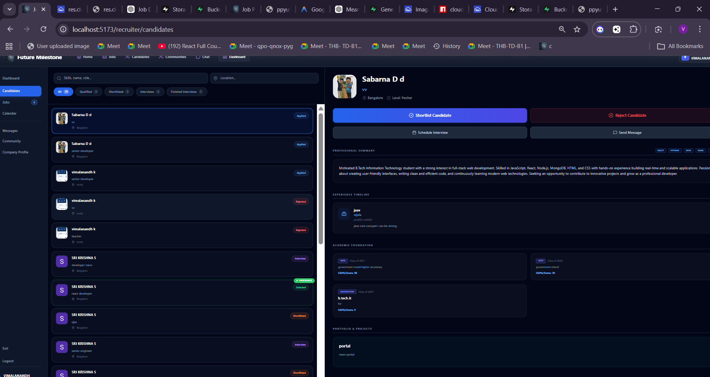

# 📊 Recruiter Side - Complete Report

## 🎯 Overview

This document provides a comprehensive overview of all features, pages, and functionality available for Employers/Recruiters in the Job Portal application.

---

## 📁 Project Structure

```
frontend/src/pages/Recruiter/
├── Landing.jsx              # Landing page for employers
├── Login.jsx                # Login with Google OAuth
├── Signup.jsx               # Signup with Google OAuth
├── Home.jsx                 # Recruiter home hub
├── Dashboard.jsx            # Main analytics dashboard
├── CompanyProfile.jsx       # Company details & verification
├── Jobs.jsx                 # Manage all job postings
├── PostJob.jsx              # Create new job listings
├── JobApplicants.jsx        # Review applicants for a specific job
├── Candidates.jsx           # Global candidate search & tracking
├── Chat.jsx                 # Real-time candidate communication
├── Community.jsx            # Recruiter social forum
├── MyPostings.jsx           # Quick view of active jobs
├── PostCourse.jsx           # Create learning courses
├── MyCourses.jsx            # Manage posted courses
└── CourseStudents.jsx       # Track student enrollments
```

---

## 🔐 Authentication System

### 1. Recruiter Login (`/recruiter/login`)

**Features:**
- ✅ Modern Google OAuth integration
- ✅ Email/Password fallback
- ✅ Role-specific login (Employer)
- ✅ Automatic dashboard redirection
- ✅ Theme-consistent UI (Indigo/Purple accents)

### 2. Recruiter Signup (`/recruiter/signup`)

**Features:**
- ✅ Company-focused registration
- ✅ Google One-Click signup
- ✅ Company email validation
- ✅ Seamless onboarding to dashboard

---

## 🏠 Main Pages

### 3. Recruiter Dashboard (`/recruiter/dashboard`)

**Overview:**
The primary command center for hiring managers, providing high-level analytics and quick access to recruitment tools.

**Key Components:**
- **Stats Overview:** Active Jobs, Total Applicants, Pending Reviews, and Total Hired counters.
- **Growth Charts:** Visual representation of application trends and hiring metrics.
- **Verification Badge:** Displays company verification level and status (verified/unverified).
- **Active Postings:** Quick list of current job listings with applicant counts.
- **Hiring Analytics:** Summary of candidate statuses (In Review, Shortlisted, Rejected).

---

### 4. Job Management (`/recruiter/jobs` & `/recruiter/post-job`)

**Purpose:**
Build and maintain a pipeline of job opportunities.

**Features:**
- **Job Creation:** Detailed forms for Title, Type (Full-time/Part-time/Remote), Description, Requirements, and Salary.
- **Management Hub:** Edit, update, or delete existing job postings.
- **Visibility Control:** Toggle job status to pause or close applications.

---

### 5. Applicant & Candidate Management

**Specific Pages:**
- **Job Applicants:** View candidates for a specific posting.
- **Candidates Hub:** Centralized database of all applicants across all jobs.

**Pro Tools:**
- ✅ **AI Match Scores:** Deterministic ATS scoring (0-100%) to identify top talent instantly.
- ✅ **Status Lifecycle:** Transition candidates through stages: `Applied` → `Screening` → `Interview` → `Offer` → `Hired`.
- ✅ **Deep Profile View:** Inspect candidate stats, professional summary, experience timeline, education history, and portfolio projects.
- ✅ **Resume Access:** Direct cloud access to candidate resumes (PDF).
- ✅ **Interview Scheduling:** Built-in tool to set dates/times and add meeting notes.

---

### 6. Communication & Community

**Features:**
- **Real-time Chat:** Direct messaging window integrated with candidate profiles for instant follow-ups.
- **Recruiter Community:** A social platform to share hiring insights, create polls, and discuss industry trends with other recruiters.
- **Communities:** Join or create specific hiring communities (e.g., "Tech Recruiters", "Remote Hiring").

---

### 7. Learning Management (Courses)

**Purpose:**
Upskill potential candidates or offer internal training.

**Features:**
- **Post Course:** Create and publish learning modules.
- **Manage Courses:** Overview of all training content.
- **Track Students:** Monitor which candidates are enrolling and progressing through courses.

---

## 🎨 UI/UX Design

### Recruiter Design Language
- **Accent Colors:** Indigo-600, Purple-500, Emerald-500.
- **Visual Style:** Premium dark mode, glassmorphism, and bold high-contrast typography.
- **Icons:** Lucide React (Users, Briefcase, Zap, Calendar, MessageSquare).
- **Animations:** Smooth Framer Motion transitions for modals and page entries.

---

## 🔗 API Integration (Employer Modules)

| Endpoint | Action |
|----------|--------|
| `GET /api/employer/dashboard-stats` | Fetch recruitment metrics |
| `GET /api/employer/jobs` | List all employer job postings |
| `POST /api/jobs` | Create new job listing |
| `PATCH /api/jobs/application/:id/status` | Update candidate status |
| `GET /api/companies/my-company` | Fetch company profile & verification |
| `POST /api/chat` | Initialize chat with applicant |

---

## ✅ Feature Checklist

### Completed:
- [x] Modern Google OAuth for Employers
- [x] AI-Powered ATS Candidate Matching
- [x] Full Lifecycle Applicant Tracking (ATS)
- [x] Real-time Messaging System
- [x] Recruitment Analytics & Growth Charts
- [x] Professional Recruiter Community Feed
- [x] Company Verification System
- [x] Course/Learning Management System

---

## 🎉 Summary

The Recruiter side is a powerful, data-driven platform designed to save time and identify quality talent. With **AI-driven insights**, **integrated communication**, and a **robust community**, recruitment has been simplified into an efficient, professional experience. 🚀
